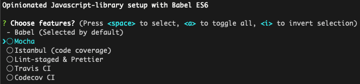

# jkallunki-scripts

Tooling for creating configurations etc.

## Usage

```bash
npx jkallunki-scripts
```

Or install and run (one time):
```bash
yarn add -D jkallunki-scripts
yarn jkallunki-scripts
```

Or install and run (global):
```bash
yarn global add jkallunki-scripts
yarn jkallunki-scripts
```
### Directly run a selected script:

```bash
yarn j-cl-babel
```



## Acknowledgements

Opinionated Javascript-library setup with Babel ES6 - based on materials at lessons from [Kent C. Dodds](https://github.com/kentcdodds)
 